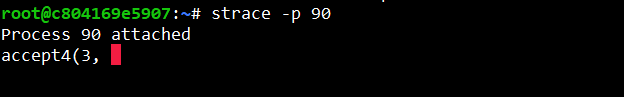
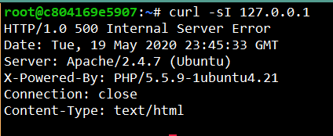

# 0x17. Web stack debugging #3
> ## Foundations - System engineering & DevOps ― Web stack debugging

### ps (process status) command

it is used to get the more and detailed information about a specific process or all processes. For example it is used to know whether a particular process is running or not, who is running what process in system, which process is using higher memory or CPU, how long a process is running, etc.

### Strace 

Strace is a diagnostic, debugging and instructional userspace utility for Linux. It is used to monitor and tamper with interactions between processes and the Linux kernel, which include system calls, signal deliveries, and changes of process state.

### debbuging Strace 

When execute cURL 127.0.0.1, strace show error in -1 ENOENT (No such file or directory)

### Probleam 

In the folder /var/www/html/wp-includes, the folder class-wp-locale.php is well written
Wordpress use a file wp-settings.php, Include files required for initialization. the file is misspelled.

