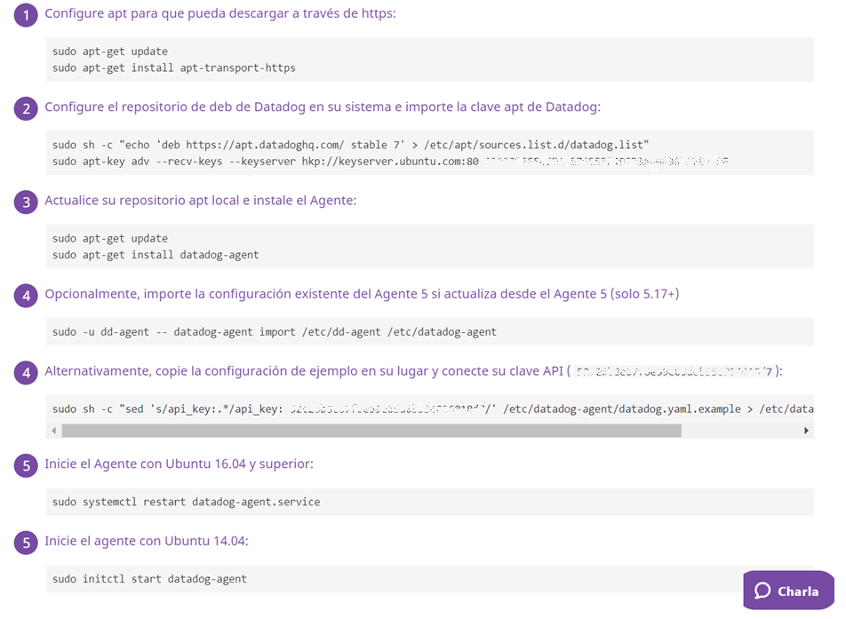
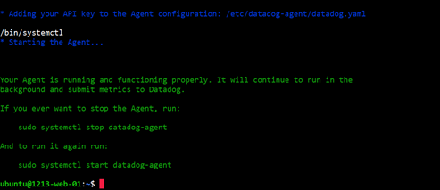
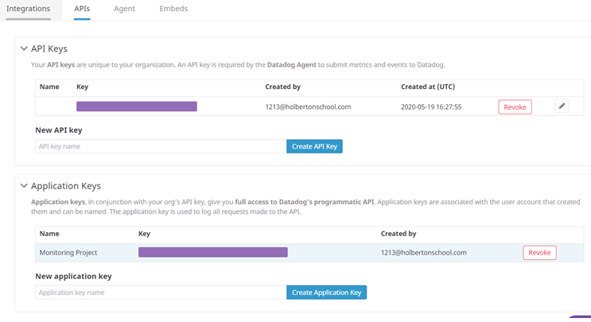
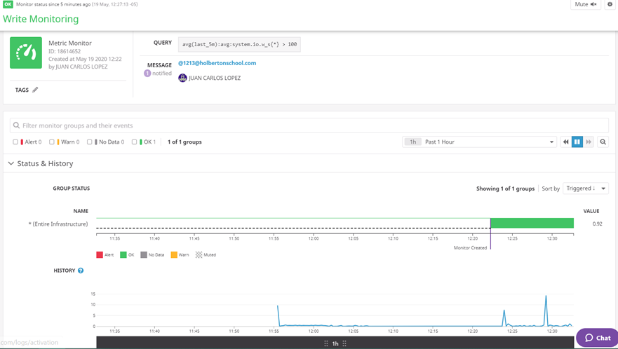

# 0x18. Webstack monitoring
> ## Foundations - System engineering & DevOps ― Web stack

### Sign up for Datadog and install datadog-agent 

For this task head to https://www.datadoghq.com/ and sign up for a free Datadog account. When signing up, you’ll have the option of selecting statistics from your current stack that Datadog can monitor for you. Once you have an account set up, follow the instructions given on the website to install the Datadog agent.

### Install Linux

> DD_AGENT_MAJOR_VERSION=7 DD_API_KEY=<the_api_key> bash -c "$(curl -L https://raw.githubusercontent.com/DataDog/datadog-agent/master/cmd/agent/install_script.sh)"

### API Key and Applicattion Key

### Monitoring metrics

Among the litany of data your monitoring service can report to you are system metrics. You can use these metrics to determine statistics such as reads/writes per second, which can help your company determine if/how they should scale. Set up some monitors within the Datadog dashboard to monitor and alert you of a few. You can read about the various system metrics that you can monitor here: . 

### Dashboard 

Now create a dashboard with different metrics displayed in order to get a few different visualizations.
 to get the id of your dashboard, you may need to use 

